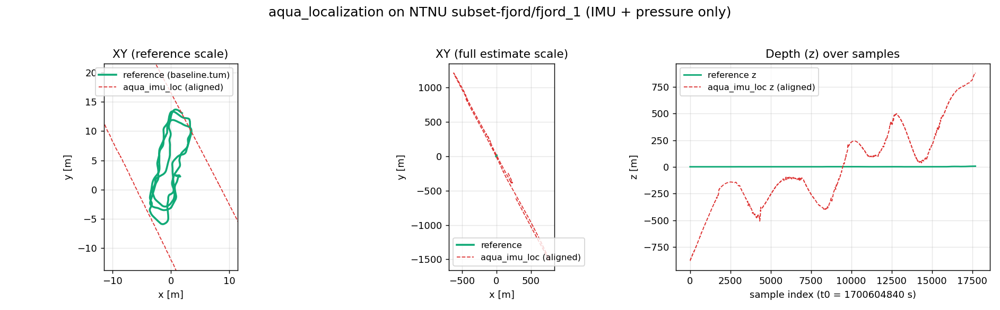

# aqua_localization Handover Plan

This document is a handover plan for continuing `aqua_localization` development after the current Codex session.
It is written for another coding agent, especially Claude, to continue without re-discovering the whole repository.

Current date context: 2026-05-07.

## Non-Negotiable Workspace Rule

All shell commands in this workspace must be prefixed with:

```bash
rtk
```

Examples:

```bash
rtk colcon build --symlink-install
rtk colcon test --packages-select aqua_imu_loc --event-handlers console_direct+
rtk rg -n "scalar_to_pressure" .
```

This comes from the workspace instruction file referenced by `AGENTS.md`.

## Project Goal

`aqua_localization` is a ROS 2 Humble/Jazzy underwater localization stack for AUV/ROV platforms.

The intended identity of the project:

- not a thin wrapper around `robot_localization`
- main IMU/depth estimator is self-implemented UKF now, with future ESKF
- pressure/depth fusion is first-class and high priority
- sonar scan matching is also first-class, not an afterthought
- architecture must be ready for later DVL, visual odometry, acoustic positioning, and tighter sonar fusion

Target platforms:

- BlueROV2-class vehicles
- custom AUVs
- `uuv_simulator`/rexrov-style simulation
- public underwater datasets for demo and validation

Primary near-term milestone:

Record a public-data localization demo video and link it from `README.md`.

## Current Repository State

The repository is not committed yet. `git status --short` currently reports all project files as untracked:

```text
?? .gitignore
?? README.md
?? aqua_fusion/
?? aqua_imu_loc/
?? aqua_localization/
?? aqua_msgs/
?? aqua_sonar_loc/
?? datasets/
?? docs/
```

Do not assume a clean git baseline. Do not reset or remove files. Work with the current tree.

## Package Layout

```text
aqua_localization/
├── PLAN.md
├── README.md
├── aqua_localization/ # metapackage, top-level launch, replay tools, RViz config
├── aqua_imu_loc/      # UKF IMU + pressure/depth localization and adapters
├── aqua_sonar_loc/    # sonar cloud preprocessing and scan matching
├── aqua_fusion/       # loosely coupled IMU/sonar odometry fusion
├── aqua_msgs/         # custom status messages
├── docs/              # architecture, MVP checklist, public demo plan
└── datasets/          # replay and dataset notes
```

## Implemented MVP

### `aqua_imu_loc`

Implemented:

- additive UKF backend in `src/additive_ukf.cpp`
- IMU preprocessing in `src/imu_preprocessor.cpp`
- pressure-to-depth converter in `src/pressure_depth_converter.cpp`
- runtime node in `src/imu_loc_node.cpp`
- `depth_to_pressure_node` for `std_msgs/msg/Float64` positive-down depth to `sensor_msgs/msg/FluidPressure`
- `scalar_to_pressure_node` for public scalar pressure/depth/barometer topics
- configs:
  - `config/params.yaml`
  - `config/bluerov2.yaml`
  - `config/uuv_simulator.yaml`
  - `config/depth_to_pressure.yaml`
  - `config/depth_to_pressure_uuv_simulator.yaml`
  - `config/scalar_to_pressure.yaml`
  - `config/scalar_to_pressure_ntnu.yaml`
- launch:
  - `launch/imu_loc.launch.py`
  - `launch/depth_to_pressure.launch.py`
  - `launch/scalar_to_pressure.launch.py`

Important behavior:

- publishes odometry and estimator status
- optionally publishes TF `map -> odom -> base_link`
- reset service is available
- pressure update constrains depth with positive-down depth mapped to negative ENU `z`
- underwater dynamics hooks include gravity, current velocity, linear drag, and buoyancy acceleration correction

Limitations:

- current UKF does not estimate IMU bias as a full error-state inertial estimator would
- orientation propagation is simple and should not be sold as production-grade inertial nav
- covariance tuning is placeholder-level
- no validated performance on public data yet

### `scalar_to_pressure_node`

This was added specifically for public datasets that do not publish `sensor_msgs/msg/FluidPressure`.

File:

- `aqua_imu_loc/src/scalar_to_pressure_node.cpp`

Supported input types:

- `std_msgs/msg/Float64`
- `std_msgs/msg/Float32`

Supported modes:

- `pressure_pa`: scalar already represents absolute pressure in pascals
- `depth_m`: scalar is positive-down depth in meters
- `ntnu_barometer`: converts using:

```text
depth = -((barometer_measurement - barometer_pressure_offset) / barometer_pressure_scale)
pressure_pa = reference_pressure_pa + rho * g * (depth + depth_offset_m)
```

NTNU config:

- `aqua_imu_loc/config/scalar_to_pressure_ntnu.yaml`

Important: the NTNU calibration values in the YAML are placeholders. The chosen sequence calibration must be filled before claiming quantitative performance.

### `aqua_sonar_loc`

Implemented:

- `SonarCloudPreprocessor`
- scan matcher interface
- `noop` matcher
- PCL ICP matcher
- runtime node `sonar_loc_node`
- filtered cloud output
- odometry output
- scan matching status output
- BlueROV2 and `uuv_simulator` configs

Limitations:

- ICP is MVP-level
- no GICP or NDT yet
- no robust sonar covariance model yet
- public sonar datasets may need conversion before they can be replayed as `sensor_msgs/msg/PointCloud2`

### `aqua_fusion`

Implemented:

- loosely coupled fuser
- fuses IMU/depth odometry with fresh sonar odometry
- publishes fused odometry and fusion status
- optionally owns TF in top-level launch

Limitations:

- not yet a tightly coupled estimator
- no DVL/visual/acoustic inputs
- covariance use is intentionally simple

### `aqua_localization`

Implemented:

- top-level launch:
  - `aqua_localization/launch/aqua_localization.launch.py`
- replay launch:
  - `aqua_localization/launch/replay.launch.py`
- RViz demo config:
  - `aqua_localization/rviz/demo.rviz`
- bag inspection script:
  - `aqua_localization/scripts/inspect_bag_topics.py`
- pytest tests:
  - `aqua_localization/test/test_inspect_bag_topics.py`

`replay.launch.py` supports:

- `ros2 bag play`
- optional loop and playback rate
- topic remapping
- `use_sim_time`
- optional depth-to-pressure adapter
- optional scalar-to-pressure adapter
- optional RViz
- toggles for IMU, sonar, and fusion nodes

`inspect_bag_topics.py` currently detects:

- IMU
- `sensor_msgs/msg/FluidPressure`
- scalar barometer/pressure topics
- scalar depth topics
- sonar `PointCloud2`
- optional current velocity

It suggests a replay command. Tests cover:

- NTNU-style `/barometer` topic enabling `scalar_to_pressure_node`
- depth-only bag using `depth_to_pressure_node`
- real `FluidPressure` taking priority over scalar adapter

## Verified Commands

The following commands were run successfully:

```bash
rtk colcon build --symlink-install
rtk colcon test --packages-select aqua_imu_loc --event-handlers console_direct+
rtk colcon build --symlink-install --packages-select aqua_localization
rtk colcon test --packages-select aqua_localization --event-handlers console_direct+
rtk colcon test-result --verbose
```

Latest observed aggregate result:

```text
Summary: 54 tests, 0 errors, 0 failures, 0 skipped
```

Also verified:

```bash
rtk bash -lc 'source install/setup.bash && ros2 launch aqua_localization replay.launch.py --show-args'
rtk bash -lc 'source install/setup.bash && ros2 launch aqua_localization aqua_localization.launch.py --show-args'
rtk python3 -m py_compile aqua_localization/scripts/inspect_bag_topics.py
```

Short launch verification for scalar adapter:

```bash
rtk bash -lc 'source install/setup.bash && timeout 5s ros2 launch aqua_localization aqua_localization.launch.py enable_scalar_to_pressure:=true scalar_to_pressure_params_file:=$(ros2 pkg prefix aqua_imu_loc)/share/aqua_imu_loc/config/scalar_to_pressure_ntnu.yaml enable_sonar_loc:=false enable_fusion:=false'
```

Observed nodes:

- `scalar_to_pressure_node`
- `imu_loc_node`

## Public Demo Target

Goal:

Record a 60-120 second public demo video and embed it in `README.md`.

README placeholder already exists:

```markdown
[](https://youtu.be/REPLACE_WITH_DEMO_VIDEO_ID)
```

Demo acceptance criteria:

- use public dataset or public simulator bag
- reproducible command in `README.md` or `datasets/README.md`
- RViz view from `aqua_localization/rviz/demo.rviz`
- visible `map -> odom -> base_link`
- visible `/aqua_imu_loc/odometry`
- if fusion/sonar available, visible `/aqua_fusion/odometry` and filtered sonar cloud
- status topics visible or inspected
- honest note distinguishing dead reckoning, scan matching, and fusion

Current honest status:

- buildable and runnable MVP
- public bag replay pipeline is prepared
- not yet validated on real public data
- video-level demo should target reproducible bringup/localization visualization first, not benchmark-quality accuracy

## Public Dataset Candidates

Main docs:

- `docs/public_dataset_candidates.md`
- `docs/public_demo_plan.md`
- `datasets/README.md`

Recommended first target:

- NTNU underwater dataset
- URL: https://huggingface.co/datasets/ntnu-arl/underwater-datasets
- reason: public hosting, documented ROS bags, BlueROV2-like platform, IMU and barometer/depth data

Backup IMU + pressure target:

- AQUALOC
- URL: http://www.lirmm.fr/aqualoc/
- paper page: https://huggingface.co/papers/1910.14532
- reason: visual-inertial-pressure underwater localization data, ROS bags/raw data reported

Sonar track:

- OpenSonarDatasets
- URL: https://github.com/remaro-network/OpenSonarDatasets
- reason: list of sonar datasets, but likely needs conversion before ICP can run

Future benchmark target:

- Tank Dataset
- URL: https://journals.sagepub.com/doi/full/10.1177/02783649251364904
- reason: IMU/depth/DVL/GT useful for later DVL and benchmarking

## Immediate Next Plan For Claude

### Step 1: Do Not Refactor First

Start with the demo pipeline. Do not begin with ESKF, GICP, NDT, or a large architecture refactor.

The user wants visible progress toward a public localization demo video.

### Step 2: Download One Small Public Dataset Segment

Preferred:

- NTNU dataset, one short Marine Cybernetics Lab trajectory if possible

Suggested flow:

```bash
rtk mkdir -p datasets/public/ntnu
```

Then use the dataset instructions from the NTNU Hugging Face card.

Important:

- the dataset may be large
- do not download the whole dataset unless necessary
- choose one short bag/sequence
- keep downloaded data out of git unless there is already an explicit data policy

If using Python/Hugging Face tooling, prefer a local cache or explicit destination under `datasets/public/ntnu`.

### Step 3: Inspect The Bag

After a bag is available:

```bash
rtk bash -lc 'source install/setup.bash && ros2 run aqua_localization inspect_bag_topics.py /path/to/bag'
```

Save the output somewhere useful, likely:

- `datasets/README.md`
- or a new dataset-specific note such as `datasets/ntnu_demo.md`

Expected outcomes:

- if `sensor_msgs/msg/FluidPressure` exists, use it directly
- if scalar barometer exists, use `scalar_to_pressure_node`
- if scalar depth exists, use `depth_to_pressure_node` or `scalar_to_pressure_node mode:=depth_m`
- if no pressure/depth exists, run IMU-only only as a debugging step, not as the target demo

### Step 4: Fill NTNU Scalar Calibration

If the bag has an NTNU-style barometer scalar:

1. Find the selected sequence calibration values.
2. Copy or create a dataset-specific YAML from:

```text
aqua_imu_loc/config/scalar_to_pressure_ntnu.yaml
```

Do not overwrite the generic starter YAML with sequence-specific values unless that is clearly wanted.

Preferred new file:

```text
aqua_imu_loc/config/scalar_to_pressure_ntnu_<sequence_name>.yaml
```

Then make sure it is installed automatically because the whole `config/` directory is installed.

### Step 5: Replay IMU + Depth First

First demo should disable sonar and fusion until the IMU/depth path is visibly stable.

Command shape:

```bash
rtk bash -lc 'source install/setup.bash && ros2 launch aqua_localization replay.launch.py \
  start_bag:=true \
  bag_path:=/path/to/ntnu_bag \
  enable_scalar_to_pressure:=true \
  bag_scalar_pressure_topic:=/barometer \
  scalar_to_pressure_params_file:=$(ros2 pkg prefix aqua_imu_loc)/share/aqua_imu_loc/config/scalar_to_pressure_ntnu.yaml \
  enable_sonar_loc:=false \
  enable_fusion:=false \
  enable_rviz:=true'
```

Adjust topic names from `inspect_bag_topics.py`.

### Step 6: Verify Runtime Signals

In separate terminals or by log inspection, confirm:

```bash
rtk bash -lc 'source install/setup.bash && ros2 topic list'
rtk bash -lc 'source install/setup.bash && ros2 topic echo /aqua_imu_loc/status --once'
rtk bash -lc 'source install/setup.bash && ros2 topic echo /aqua_imu_loc/odometry --once'
rtk bash -lc 'source install/setup.bash && ros2 run tf2_ros tf2_echo map odom'
rtk bash -lc 'source install/setup.bash && ros2 run tf2_ros tf2_echo odom base_link'
```

Expected:

- status topic reports accepted IMU and pressure/depth updates
- odometry is published
- TF exists
- depth update should keep vertical drift bounded compared with IMU-only

### Step 7: Make Demo RViz Usable

Current RViz config exists:

```text
aqua_localization/rviz/demo.rviz
```

If public data uses different frames or topics, update RViz conservatively.

Do not create a marketing page. The first screen should be the actual localization visualization.

For a clean video, show:

- Grid
- TF
- `/aqua_imu_loc/odometry`
- `/aqua_fusion/odometry` only if fusion is enabled and meaningful
- sonar filtered point cloud only if sonar data is valid

### Step 8: Record A Short Demo

Create:

```text
docs/media/public_demo_thumbnail.png
```

When the video is uploaded, replace in `README.md`:

```text
https://youtu.be/REPLACE_WITH_DEMO_VIDEO_ID
```

Also add the exact replay command used.

### Step 9: Commit-Ready Cleanup

Before presenting final work:

```bash
rtk colcon build --symlink-install
rtk colcon test --event-handlers console_direct+
rtk colcon test-result --verbose
rtk git status --short
```

If full tests are too slow, at minimum:

```bash
rtk colcon test --packages-select aqua_imu_loc aqua_localization --event-handlers console_direct+
rtk colcon test-result --verbose
```

## Known Risks

### Public Dataset Download Size

NTNU may be large. Avoid broad downloads. Pick one sequence.

### NTNU Calibration

`scalar_to_pressure_ntnu.yaml` has placeholder calibration values. A demo can show bringup with placeholders only if clearly labeled, but it should not claim quantitative accuracy.

### Time Stamps In Adapter Nodes

Current adapter nodes publish `FluidPressure` with `now()` because scalar messages have no header.
For rosbag replay with `use_sim_time`, this should be acceptable for bringup, but it is not ideal for high-quality time alignment.

Potential improvement:

- support `Header`-bearing scalar custom messages if dataset provides them
- or add a small bag conversion script that writes proper `FluidPressure` messages with original timestamps

### IMU-Only Drift

Do not oversell horizontal localization from pure IMU. Underwater dead reckoning without DVL/acoustic/visual aid will drift. The first demo should emphasize:

- depth constraint from pressure/barometer
- estimator status
- reproducible ROS 2 replay
- TF and odometry pipeline

### Sonar Data Format

Many public sonar datasets are images or raw sonar returns, not metric `PointCloud2`.
Do not assume `aqua_sonar_loc` can run on a sonar dataset without conversion.

### TF Ownership

Top-level launch switches TF ownership:

- fusion enabled: `aqua_fusion` owns TF
- fusion disabled: `aqua_imu_loc` owns TF

If TF duplicates appear, inspect `publish.tf` parameters.

## Recommended Next Code Improvements

Only after the first public replay works:

1. Add a bag conversion utility for scalar barometer/depth to `FluidPressure` with preserved timestamps.
2. Add dataset-specific docs for the exact public sequence.
3. Add a launch preset for the chosen public sequence.
4. Add an RViz config specifically for public demo if needed.
5. Add optional CSV export of odometry/status for quick plotting.
6. Improve UKF state with accelerometer/gyro bias terms or start the ESKF backend.
7. Add sonar registration quality gating and covariance estimation.
8. Add GICP/NDT backends.
9. Add DVL input and benchmark against datasets with DVL/GT.

## Suggested Files To Read First

Read these before editing:

```text
README.md
docs/architecture.md
docs/mvp_checklist.md
docs/public_demo_plan.md
docs/public_dataset_candidates.md
datasets/README.md
aqua_localization/launch/replay.launch.py
aqua_localization/scripts/inspect_bag_topics.py
aqua_imu_loc/src/imu_loc_node.cpp
aqua_imu_loc/src/scalar_to_pressure_node.cpp
aqua_imu_loc/config/scalar_to_pressure_ntnu.yaml
```

## Suggested First Claude Task

Continue with this exact task:

> Download or prepare one small NTNU public dataset sequence, run `inspect_bag_topics.py`, create a dataset-specific replay note and scalar barometer calibration YAML if needed, then verify that `aqua_imu_loc` publishes odometry/status/TF in RViz with sonar and fusion disabled.

Expected output from that task:

- dataset path and sequence name
- detected topics table
- exact replay command
- any new config YAML
- whether odometry/status/TF were observed
- whether the result is ready for a short README demo video

## Definition Of Done For The Public Demo MVP

The public demo MVP is done when:

- one public dataset sequence is named and documented
- replay command is reproducible from a clean shell after `source install/setup.bash`
- RViz starts with useful displays
- `/aqua_imu_loc/status` shows accepted IMU and pressure/depth updates
- `/aqua_imu_loc/odometry` publishes during replay
- TF `map -> odom -> base_link` exists
- README includes the final command and video link or local recording plan
- tests pass after any code changes

This is the correct short-term target. Full localization accuracy benchmarking is a later milestone.
