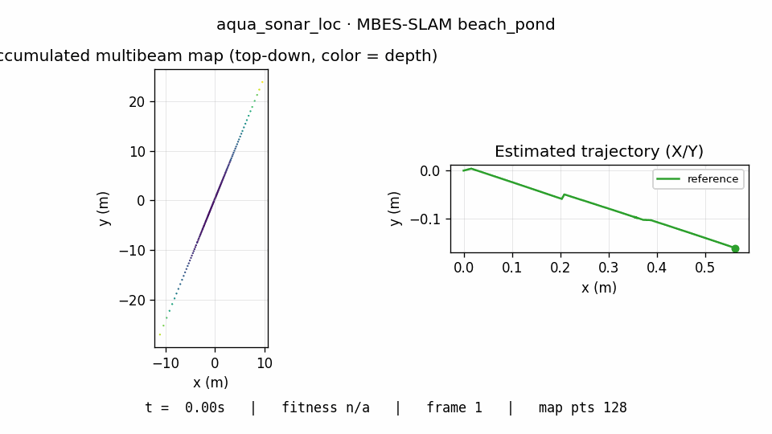
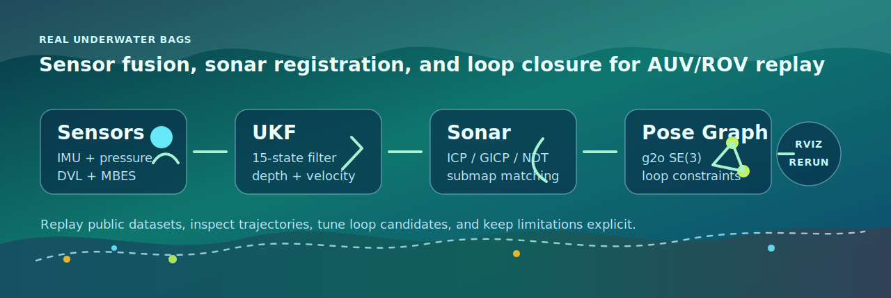
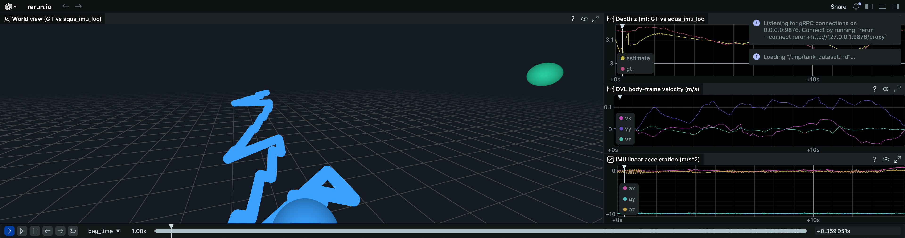
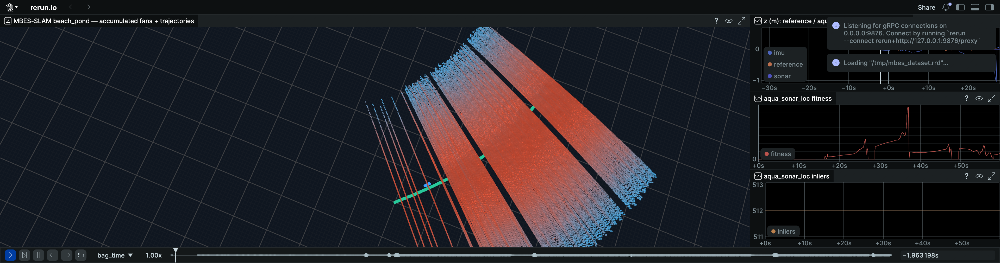
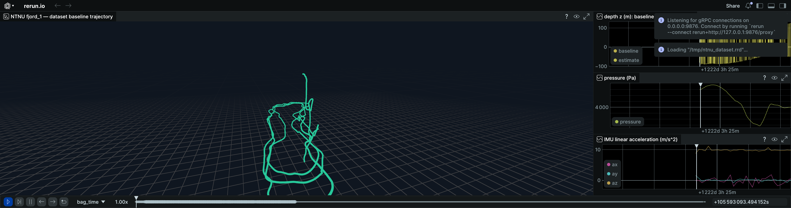
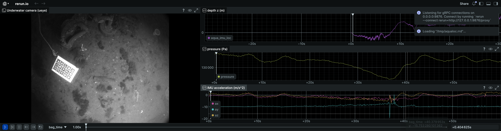

<h1 align="center">aqua_localization</h1>

<p align="center">
  <b>ROS 2 underwater localization for real AUV/ROV data.</b><br>
  Fuse IMU, pressure, DVL, sonar registration, and pose-graph loop closure
  into a stack built around public ocean datasets.
</p>

<p align="center">
  <a href="https://docs.ros.org/en/humble/"></a>
  <a href="https://docs.ros.org/en/jazzy/"></a>
  <a href="LICENSE"></a>
  <a href="https://github.com/rsasaki0109/aqua_localization/releases"></a>
</p>

<p align="center">
  
</p>

This repository is shaped around the parts that make ocean localization hard:
GNSS disappears at the surface boundary, pressure becomes a primary depth
measurement, DVL arrives in the vehicle frame, and sonar returns can be sparse
or geometrically ambiguous. The stack combines a 15-state additive UKF,
pressure-depth updates, DVL velocity updates, PCL-based sonar registration, a
g2o SE(3) pose graph backend, and an experimental MBES submap loop-closure
front end.

The main story is intentionally public-data first: four underwater datasets,
four [rerun.io](https://rerun.io) renderings, no synthetic bag or
simulator-only demo as the headline result. Targets BlueROV2-class ROVs,
custom AUVs, and `uuv_simulator`. ROS 2 Humble and Jazzy are supported.

Latest release: **[v0.2](https://github.com/rsasaki0109/aqua_localization/releases/tag/v0.2)**.

<p align="center">
  
</p>

## Start Here

| Goal | Where to go |
|------|-------------|
| Open the visual project page | [`docs/index.html`](docs/index.html) |
| Preview the underwater 3DGS research track | [`docs/experiments/underwater_3dgs_demo.html`](docs/experiments/underwater_3dgs_demo.html) |
| See real underwater outputs | [Public-data results](#public-data-results) |
| Build and launch the stack | [Run it](#run-it) |
| Try pose-graph loop closure without a bag | [Loop-closure smoke test](#loop-closure-smoke-test) |
| Tune MBES loop closure on a real bag | [Experimental MBES loop closure](#experimental-mbes-loop-closure) |
| Understand package ownership | [Stack map](#stack-map) |
| Check known limits before using it | [Project status](#project-status) |

## What It Does

| Signal | Why it matters underwater |
|--------|---------------------------|
| **Pressure depth** | Keeps the vertical axis observable below the surface. |
| **DVL velocity** | Provides vehicle-frame motion constraints for AUV/ROV dead reckoning. |
| **Stereo camera** | Experimental ORB + PnP visual odometry for Tank-style underwater stereo bags. |
| **Multibeam sonar** | Turns acoustic fans into bathymetric structure for registration. |
| **Pose graph edges** | Keeps long seafloor replays inspectable through keyframes and loop constraints. |
| **rerun / RViz views** | Shows trajectories, sonar clouds, loop candidates, and tuning diagnostics. |

Underwater localization usually needs more than a generic planar robot
stack: pressure/depth is a first-class measurement, DVL velocity arrives
in the vehicle frame, sonar geometry can be degenerate, and public
benchmarks often use ROS bags with dataset-specific topics. This repository
keeps those underwater-specific paths explicit and testable.

## Public-Data Results

Each row has a one-shot recorder and rerun export script. The images below are
generated from recorded demo bags, so the README is tied to replayable data
instead of hand-captured screenshots.

| Dataset | What it shows | rerun screenshot |
|---------|---------------|------------------|
| **Tank Dataset `short_test`** | DVL fusion **0.43 m APE RMSE**; experimental visual-aided fusion **0.37 m** with same-sequence scale fit | [`tank_dataset_rerun.png`](docs/media/tank_dataset_rerun.png) |
| **MBES-SLAM `beach_pond`** | Multibeam fans accumulated into a depth-coloured bathymetric scan | [`mbes_slam_rerun.png`](docs/media/mbes_slam_rerun.png) |
| **NTNU `subset-fjord/fjord_1`** | Dataset SLAM baseline through a 7 m fjord dive | [`ntnu_fjord_1_rerun.png`](docs/media/ntnu_fjord_1_rerun.png) |
| **AQUALOC `harbor_07`** | LIRMM "Dumbo" ROV underwater camera + pressure depth track | [`aqualoc_harbor_07_rerun.png`](docs/media/aqualoc_harbor_07_rerun.png) |

<p>
  
  
  
  
</p>

## Run It

### Build

```bash
# Clone into a colcon workspace, install dependencies, build, and source.
git clone https://github.com/rsasaki0109/aqua_localization.git
cd aqua_localization && rosdep install --from-paths . --ignore-src -r -y
cd ..
colcon build --symlink-install
source install/setup.bash

# Launch the full stack with default parameters.
ros2 launch aqua_localization aqua_localization.launch.py
```

### Public Demo

The smallest validated path is the Tank Dataset `short_test` sequence:
about 15 seconds of real underwater motion with IMU, pressure-derived
depth, DVL, and AprilTag ground truth.

```bash
# After following datasets/tank_dataset_demo.md to download and convert
# short_test.bag, record the estimator outputs into a self-contained demo bag.
ros2 run aqua_localization record_tank_demo.sh

# Export to rerun.io for a browser-friendly 3D + plots replay.
ros2 run aqua_localization rerun_export.py \
  --bag aqua_localization/datasets/public/tank_dataset/demo_with_estimate \
  --out /tmp/tank.rrd
rerun /tmp/tank.rrd
```

Per-dataset bring-up notes include download size, conversion steps,
dataset-specific calibration, and replay commands:

- [`datasets/tank_dataset_demo.md`](datasets/tank_dataset_demo.md)
- [`datasets/mbes_slam_demo.md`](datasets/mbes_slam_demo.md)
- [`datasets/ntnu_demo.md`](datasets/ntnu_demo.md)
- [`datasets/aqualoc_demo.md`](datasets/aqualoc_demo.md)

### Loop-Closure Smoke Test

No bag is needed for the pose-graph loop-closure smoke path. This starts the
g2o backend, publishes a tiny odometry chain plus one loop constraint, and
checks that the graph accepted both the keyframes and the loop edge:

```bash
ros2 run aqua_localization pose_graph_loop_smoke.sh
```

The same lower-level publisher is available as
`ros2 run aqua_localization pose_graph_loop_demo.py` when you want to launch
`aqua_pose_graph` yourself and inspect `/aqua_pose_graph/path`.

## Stack Map

| Package | Role |
|---------|------|
| [`aqua_imu_loc`](aqua_imu_loc) | 15-state additive UKF for IMU, pressure, DVL, and sonar position updates |
| [`aqua_sonar_loc`](aqua_sonar_loc) | PointCloud2 preprocessing and PCL ICP/GICP/NDT registration with a submap front end |
| [`aqua_fusion`](aqua_fusion) | Loose-coupling fusion of IMU/depth and sonar odometry |
| [`aqua_pose_graph`](aqua_pose_graph) | g2o SE(3) keyframe graph with external loop-constraint input |
| [`aqua_msgs`](aqua_msgs) | Diagnostic and fusion-input message types |
| [`aqua_localization`](aqua_localization) | Metapackage, top-level launches, dataset scripts, and replay exports |

Detailed architecture per package: [`docs/architecture.md`](docs/architecture.md).

## Experimental MBES Loop Closure

The MBES path now includes an experimental submap-vs-submap loop-closure
front end. It accumulates bathymetric submaps between pose-graph keyframes,
tests odometry-near historical candidates with ICP/GICP/NDT, publishes
accepted constraints to `/aqua_pose_graph/loop_constraint`, and exposes
tuning diagnostics on `/mbes_loop_closure/status` plus RViz markers on
`/mbes_loop_closure/markers`.

Use the dedicated RViz view while tuning real bags:

```bash
ros2 launch aqua_localization replay.launch.py \
  start_bag:=true \
  bag_path:=aqua_localization/datasets/public/mbes_slam/beach_pond_ros2 \
  bag_sonar_points_topic:=/norbit/detections \
  use_sim_time:=true \
  enable_pose_graph:=true \
  enable_mbes_loop_closure:=true \
  enable_rviz:=true \
  rviz_config_file:=$(ros2 pkg prefix aqua_localization)/share/aqua_localization/rviz/mbes_loop_closure.rviz
```

This front end is not yet production-tuned; the next reliability step is
real-bag status export, threshold sweeps, and false-positive analysis.

## Visualization Exports

Two browser-friendly paths run on the same self-contained demo bag:

- **rerun.io** — the recommended default. Use
  [`rerun_export*.py`](aqua_localization/scripts) to write a `.rrd` with
  a curated 3D + plots blueprint, then open it locally with
  `rerun some.rrd`. Headless `--screenshot-to` produces the README
  thumbnails.
- **Lichtblick** (Apache-2.0 fork of Foxglove Studio) — drag the
  `.mcap` onto <https://lichtblick-suite.github.io/lichtblick/> and
  import [`docs/foxglove/aqua_tank_demo.json`](docs/foxglove/aqua_tank_demo.json).
  The accompanying [`lichtblick_screenshot.py`](aqua_localization/scripts/lichtblick_screenshot.py)
  drives the same flow headlessly via Playwright.

Bag-recording recipe: [`docs/foxglove/README.md`](docs/foxglove/README.md).

## Project Status

### Roadmap

The headline next milestone is **reliable real-data loop closure**. The
pose-graph backend and an experimental MBES front end are in place; the
remaining work is threshold tuning, candidate reliability, information
matrix calibration, and eventually visual loop closure for AQUALOC. ESKF
backend, magnetometer fusion, and acoustic positioning are also on the list.

Plan and state of the stack: [`PLAN.md`](PLAN.md).
Verified-feature checklist: [`docs/mvp_checklist.md`](docs/mvp_checklist.md).
Per-platform benchmarks: [`docs/benchmarks/`](docs/benchmarks).
OSS comparison plan: [`docs/benchmarks/oss_comparison.md`](docs/benchmarks/oss_comparison.md).
AQUA-SLAM comparison plan: [`docs/benchmarks/aqua_slam_comparison.md`](docs/benchmarks/aqua_slam_comparison.md).
Tank vs AQUA-SLAM table: [`docs/benchmarks/tank_aqua_slam.md`](docs/benchmarks/tank_aqua_slam.md).
Public launch checklist: [`docs/public_launch_checklist.md`](docs/public_launch_checklist.md).
MBES loop closure plan: [`docs/mbes_loop_closure.md`](docs/mbes_loop_closure.md).

### Honest Limitations

- IMU-only dead reckoning drifts roughly an order of magnitude on bags
  without DVL/visual aiding (NTNU `fjord_1`, AQUALOC `harbor_07` show
  hundreds of meters of XY drift; depth `z(t)` tracks well via the
  pressure update).
- Single-fan multibeam registration is geometrically degenerate.
  Tightly-coupled sonar feedback narrows MBES-SLAM `beach_pond` fusion
  drift from ±40 m to ~17 m, but per-fan residuals are still ~10 m
  magnitude. The pose graph backend and experimental MBES loop-closure
  front end ship, but the loop-closure thresholds and information matrix
  are not yet calibrated on a full real-bag tuning run.
- `aqua_fusion` has unit + runtime tests but no per-platform benchmark
  history yet.

## Testing

```bash
colcon test --packages-select \
  aqua_imu_loc aqua_sonar_loc aqua_fusion aqua_pose_graph aqua_localization \
  --event-handlers console_direct+
```

Run `colcon test-result --verbose` after testing for the current count; the
latest local validation before this README refresh reported 92 tests with
zero failures.

## Contributing

Bug reports, dataset bring-up notes, benchmark results, and focused pull
requests are welcome. Start with [`CONTRIBUTING.md`](CONTRIBUTING.md)
for the expected build/test commands and issue templates.

## License

Apache-2.0. See [`LICENSE`](LICENSE) and individual `package.xml` files
for per-package maintainer info.
