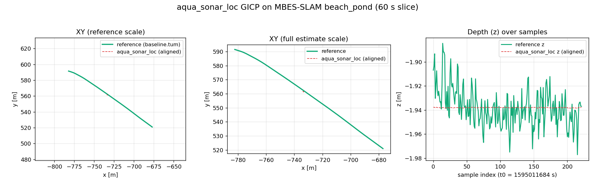

# aqua_localization

`aqua_localization` is a ROS 2 localization stack for underwater robots. The package is designed around two equally important localization paths:

- high-rate dead reckoning from IMU and pressure/depth sensors
- sonar point cloud registration from Forward-Looking Sonar (FLS) or multibeam sonar

The target robots are BlueROV2-class ROVs, custom AUVs, and simulator platforms such as `uuv_simulator`. ROS 2 Humble and Jazzy are the primary supported distributions.

## Packages

```text
aqua_localization/
├── aqua_localization/ # ROS 2 metapackage
├── aqua_imu_loc/      # Main IMU + pressure localization package
├── aqua_sonar_loc/    # Sonar point cloud preprocessing and scan matching
├── aqua_fusion/       # Loosely/tightly coupled IMU + sonar fusion
├── aqua_msgs/         # Project-specific messages, services, and actions
├── docs/              # Design notes and dataset documentation
└── datasets/          # Dataset adapters, download notes, and examples
```

## Status

**MVP complete and validated against public data on both localization tracks.** The stack
builds clean on ROS 2 Humble/Jazzy, all 120 unit + runtime tests pass, and the two
canonical demos run end-to-end against real public bags (no simulation, no synthetic
bag in the headline path):

- IMU + pressure dead reckoning replays NTNU `subset-fjord/fjord_1` through `aqua_imu_loc` —
  see [datasets/ntnu_demo.md](datasets/ntnu_demo.md) for measured APE and the AHRS-bias hook tuning.
- Multibeam sonar registration replays MBES-SLAM `beach_pond` through `aqua_sonar_loc` GICP —
  see [datasets/mbes_slam_demo.md](datasets/mbes_slam_demo.md) for measured APE and the
  documented limit of scan-to-scan multibeam.

Honest accuracy: IMU-only dead reckoning drifts roughly an order of magnitude (no DVL,
no visual aiding); scan-to-scan multibeam saturates at ~30 m APE on `beach_pond` because
single fans are geometrically degenerate (the IJRR 2021 paper accumulates submaps with
external navigation — that's the documented next step).

## Current Features

- ROS 2 Humble/Jazzy `ament_cmake` packages, C++17-first
- Additive UKF for IMU + pressure (15-state: pose, velocity, accel/gyro biases)
- Pressure/depth direct measurement update with seawater density conversion
- Optional AHRS hooks: yaw observation, gyro_z bias from AHRS yaw rate, 3-axis gyro bias
- Static-bias initializer with motion-detection abort
- Sonar `PointCloud2` validation, range/finite filtering, accepted-cloud passthrough
- Scan matcher interface with PCL ICP, PCL GICP, and `noop` backends
- Quality gating after registration (`max_fitness_score`, `max_translation_step_m`, `max_rotation_step_rad`)
- Submap front end (`submap_size > 1` with `use_motion_prior`) — wired and tested,
  unlocks once an external IMU/DVL motion prior feeds the registration
- Loosely coupled IMU/sonar odometry fusion
- Custom diagnostic messages: `EstimatorStatus`, `ScanMatchingStatus`, `FusionStatus`
- Configurable underwater dynamics: gravity, water-current input, linear drag, buoyancy
- TF publication for `map -> odom -> base_link` with automatic ownership switching
- YAML-first configuration with vehicle starter profiles (BlueROV2, NTNU fjord, MBES-SLAM, uuv_simulator)
- Scalar pressure / depth-to-pressure adapters for public bags without `FluidPressure`
- Trajectory record (TUM/CSV) and Umeyama-aligned APE comparison + matplotlib thumbnails (numpy-only, no `evo` dependency)
- Helper scripts: bag inspection, scalar-pressure pre-conversion, yaw-frame diagnosis,
  synthetic-sonar bag generator, NTNU `fjord_1` benchmark runner

`robot_localization` is intentionally not the main path. It may be added later only as a comparison backend.

## Not Yet in the Stack

- production-grade ESKF backend
- validated sonar covariance estimation
- NDT scan-matching backend
- DVL or visual odometry inputs
- tightly coupled sonar residual fusion
- submap-based bathymetric SLAM front end with external IMU/DVL motion prior wiring
  (the submap registration code itself is shipped; only the prior-subscription wiring is pending)

See [docs/mvp_checklist.md](docs/mvp_checklist.md) for the verification checklist.
See [PLAN.md](PLAN.md) for the handover plan and public-demo next steps.

## Public-Data Demo

MBES-SLAM `beach_pond` — 8 s slice of multibeam fans replayed through `aqua_sonar_loc`
GICP. Left panel: accumulated multibeam fans transformed by the bag's ROS 1 EKF
reference into world coordinates (color = depth); right panel: reference (green)
and `aqua_sonar_loc` estimate (blue) trajectories. With no IMU motion prior the
estimate currently stays near origin on this geometrically degenerate single-fan
geometry — see [`datasets/mbes_slam_demo.md`](datasets/mbes_slam_demo.md) for the
diagnosis and the planned IMU-prior wiring (now landed in
[`aqua_sonar_loc`](aqua_sonar_loc/config/params.yaml#motion_prior); awaiting an
IMU-only `aqua_imu_loc` profile for this bag to exercise it end-to-end):


Per-trajectory breakdowns:

NTNU `subset-fjord/fjord_1` — IMU + pressure dead reckoning, Umeyama-aligned APE vs the dataset baseline:


MBES-SLAM `beach_pond` — `aqua_sonar_loc` GICP scan-to-scan vs the bag's ROS 1 EKF baseline:



Static thumbnails are regenerated by [`plot_trajectories.py`](aqua_localization/scripts/plot_trajectories.py)
from recorded TUM trajectories; the GIF is regenerated by
[`make_demo_gif.py`](aqua_localization/scripts/make_demo_gif.py) — see
[`datasets/mbes_slam_demo.md`](datasets/mbes_slam_demo.md) for the exact command
and the `--reference-odometry` flag that drives the world-frame map view.

Recording targets and the maintained dataset shortlist live in
[docs/public_demo_plan.md](docs/public_demo_plan.md) and
[docs/public_dataset_candidates.md](docs/public_dataset_candidates.md).

### Web replay (Foxglove Studio)

For a browser-only view that does not require a local RViz, drop a
results-included `.mcap` onto [Foxglove Studio](https://studio.foxglove.dev/)
and import [`docs/foxglove/aqua_tank_demo.json`](docs/foxglove/aqua_tank_demo.json):
3D trajectory follows `base_link`, GT (green) and `aqua_imu_loc` estimate
(blue) are overlaid, and the right column plots depth and DVL body-frame
velocity.

See [`docs/foxglove/README.md`](docs/foxglove/README.md) for the recording
recipe that produces the input bag (it captures both the source sensor
streams and `aqua_imu_loc` output topics into a single self-contained
`.mcap`).

## Architecture

### `aqua_imu_loc`

Dead-reckoning package. Currently runs an additive UKF for high-rate IMU and pressure/depth fusion. The prediction model is structured so underwater dynamics (gravity, drag, water current, buoyancy) can be expanded without rewriting the estimator interface. An ESKF backend is on the roadmap.

### `aqua_sonar_loc`

Sonar localization package. Inputs are `sensor_msgs/msg/PointCloud2` from FLS, multibeam sonar, or simulation. The package validates x/y/z fields, filters non-finite and out-of-range points, republishes accepted clouds, and publishes odometry through a scan matcher interface. Shipped backends are PCL ICP, PCL GICP, and `noop`. The submap front end (concatenating the last K aligned fans, optionally driven by a constant-velocity motion prior) is wired and tested; NDT and feature-based matching are still planned.

### `aqua_fusion`

Fusion package for combining IMU/depth odometry and sonar registration. The current implementation is a loosely coupled odometry fuser that blends fresh sonar position into IMU odometry. Tightly coupled sonar residual integration is reserved for a later stage.

### `aqua_msgs`

Shared custom interfaces for estimator diagnostics (`EstimatorStatus`), scan matching diagnostics (`ScanMatchingStatus`), fusion diagnostics (`FusionStatus`), water-current estimates, and future DVL/visual factors.

## Installation

Install ROS 2 Humble or Jazzy, then create or use a colcon workspace:

```bash
mkdir -p ~/aqua_ws/src
cd ~/aqua_ws/src
git clone <this-repository-url> aqua_localization
cd ~/aqua_ws
rosdep install --from-paths src --ignore-src -r -y
colcon build --symlink-install
source install/setup.bash
```

For the current skeleton, the only runtime ROS dependencies are standard ROS 2 packages such as `rclcpp`, `sensor_msgs`, `nav_msgs`, `geometry_msgs`, `tf2`, and `tf2_ros`.

## Quick Start

Run the NTNU public-data demo (downloads and converts a 12.5 GB sequence the first time, then replays
~5 minutes of IMU + pressure data with RViz):

```bash
# 1. Download the smallest fjord trajectory (~12.5 GB) — see datasets/ntnu_demo.md.
# 2. Convert ROS 1 .bag to ROS 2 mcap, dropping cameras:
rosbags-convert \
  --src aqua_localization/datasets/public/ntnu/subset-fjord/fjord_1/fjord_1.bag \
  --dst aqua_localization/datasets/public/ntnu/subset-fjord/fjord_1/fjord_1_ros2 \
  --dst-storage mcap --dst-typestore ros2_jazzy \
  --include-topic /alphasense_driver_ros/imu /mavros/imu/data /mavros/imu/static_pressure /mavros/rangefinder/rangefinder /tf
# 3. Launch with the demo preset:
ros2 launch aqua_localization ntnu_fjord_demo.launch.py
```

See [datasets/ntnu_demo.md](datasets/ntnu_demo.md) for the full replay note, detected topics, and
honest status.

Run the MBES-SLAM public-data demo (downloads and converts a 2.5 GB ROS 1 bag, then replays a 60 s
slice of real Norbit multibeam through `aqua_sonar_loc` GICP):

```bash
# 1. Download (~2.5 GB tar.gz, 6.8 GB after extract):
mkdir -p aqua_localization/datasets/public/mbes_slam && cd aqua_localization/datasets/public/mbes_slam
wget --no-check-certificate https://seaward.science/files/pos-datasets/bag/beach_pond.tar.gz
tar xzf beach_pond.tar.gz && cd ../../../..
# 2. Convert ROS 1 .bag to ROS 2 mcap, keeping only standard-typed topics:
rosbags-convert \
  --src aqua_localization/datasets/public/mbes_slam/beach_pond/beach_pond.bag \
  --dst aqua_localization/datasets/public/mbes_slam/beach_pond_ros2 \
  --dst-storage mcap --src-typestore ros1_noetic --dst-typestore ros2_jazzy \
  --include-topic /norbit/detections /nav/sensors/microstrain/imu/raw \
                  /nav/processed/microstrain/imu/madgwick /nav/sensors/microstrain/mag/raw \
                  /nav/processed/odometry /nav/sensors/navsat/ubx_pos/fix /tf /tf_static
# 3. Replay sonar-only (Terminal A: stack):
ros2 launch aqua_localization replay.launch.py \
  start_bag:=false use_sim_time:=true enable_imu_loc:=false enable_fusion:=false \
  sonar_params_file:=$(ros2 pkg prefix aqua_sonar_loc)/share/aqua_sonar_loc/config/mbes_slam.yaml \
  bag_sonar_points_topic:=/norbit/detections
# 4. Terminal B: bag.
ros2 bag play aqua_localization/datasets/public/mbes_slam/beach_pond_ros2 \
  --clock --start-offset 60 --playback-duration 60
```

See [datasets/mbes_slam_demo.md](datasets/mbes_slam_demo.md) for the full replay note, measured
APE numbers (rigid SE(3) and Sim(3)), and honest status on scan-to-scan multibeam.

Launch the full localization stack:

```bash
ros2 launch aqua_localization aqua_localization.launch.py
```

Disable optional parts when replaying partial bags:

```bash
ros2 launch aqua_localization aqua_localization.launch.py enable_sonar_loc:=false enable_fusion:=false
```

Launch the stack for rosbag replay:

```bash
ros2 launch aqua_localization replay.launch.py
```

Start the stack and play a bag from the same launch file:

```bash
ros2 launch aqua_localization replay.launch.py start_bag:=true bag_path:=/path/to/rosbag2
```

Start with the demo RViz view:

```bash
ros2 launch aqua_localization replay.launch.py start_bag:=true bag_path:=/path/to/rosbag2 enable_rviz:=true
```

Inspect a rosbag2 directory and print suggested replay arguments:

```bash
ros2 run aqua_localization inspect_bag_topics.py /path/to/rosbag2
```

Record the live `/aqua_imu_loc/odometry` (or any `nav_msgs/Odometry` topic) to TUM or CSV for offline
comparison with public-dataset baselines:

```bash
ros2 run aqua_localization record_odometry.py \
  --topic /aqua_imu_loc/odometry \
  --out trajectory.tum \
  --format tum
```

Record the live `/aqua_imu_loc/status` (`aqua_msgs/EstimatorStatus`) to a CSV — useful for plotting
bias convergence and verifying the AHRS hooks are firing on a given bag:

```bash
ros2 run aqua_localization record_status.py \
  --topic /aqua_imu_loc/status \
  --out status.csv
```

Compare a recorded trajectory to a reference TUM file (Umeyama-aligned APE statistics, numpy-only):

```bash
ros2 run aqua_localization compare_trajectories.py reference.tum trajectory.tum
```

Generate a synthetic sonar `sensor_msgs/PointCloud2` rosbag2 (a fixed point field viewed from a robot
moving along world +x at constant speed). This is a regression-test fixture for `aqua_sonar_loc`,
not the headline demo — for the headline demo use the MBES-SLAM `beach_pond` workflow above:

```bash
ros2 run aqua_localization make_synthetic_sonar_bag.py \
  --dst /tmp/synthetic_sonar_bag --topic /sonar/points \
  --num-points 400 --num-steps 120 --dt 0.1 --speed-m-s 0.5 --max-range-m 40.0 --overwrite

ros2 launch aqua_localization replay.launch.py \
  start_bag:=true bag_path:=/tmp/synthetic_sonar_bag \
  bag_sonar_points_topic:=/sonar/points use_sim_time:=true \
  enable_imu_loc:=false enable_fusion:=false
```

The bag plays for 12 s and `aqua_sonar_loc` ICP recovers ~-0.5 m/s in body x (scene approaches the
robot), which matches the synthesized +0.5 m/s world motion.

Pre-convert a scalar pressure/depth/barometer topic in a rosbag2 to `sensor_msgs/msg/FluidPressure`
with original timestamps preserved. This is the high-fidelity alternative to the runtime
`scalar_to_pressure_node`:

```bash
ros2 run aqua_localization convert_scalar_pressure_bag.py \
  --src /path/to/source_bag \
  --dst /path/to/source_bag_pressure \
  --scalar-topic /barometer \
  --pressure-topic /pressure \
  --mode ntnu_barometer \
  --replace
```

Drive the gyro_z bias from an AHRS yaw rate (helps when the platform exposes a Madgwick/Mahony
quaternion in `sensor_msgs/Imu.orientation` — enabled by default in `ntnu_fjord.yaml`):

```yaml
aqua_imu_loc:
  ros__parameters:
    imu:
      use_ahrs_gyro_bias_z: true
      ahrs_gyro_bias_z_variance_rad2_s2: 1.0e-2
      ahrs_gyro_bias_z_subsample: 20
      ahrs_gyro_bias_z_max_dt_s: 0.5
```

Diagnose the yaw-frame consistency between gyro integration and an AHRS quaternion in a
rosbag2 (helps decide whether `imu.use_orientation_yaw` will hurt or help on a given
sequence):

```bash
ros2 run aqua_localization diagnose_yaw_frame.py /path/to/rosbag2 \
  --imu-topic /mavros/imu/data --csv-out /tmp/yaw_diag.csv
```

Run the NTNU `fjord_1` APE benchmark and append the result to `docs/benchmarks/fjord_1.md`:

```bash
ros2 run aqua_localization bench_fjord_1.sh
BENCH_NOTE="describe the change" ros2 run aqua_localization bench_fjord_1.sh
```

Enable externally provided water-current velocity for the UKF drag model:

```bash
ros2 launch aqua_localization aqua_localization.launch.py current_velocity_topic:=/water_current
```

Remap bag topics when they differ from the package defaults:

```bash
ros2 launch aqua_localization replay.launch.py start_bag:=true bag_path:=/path/to/rosbag2 bag_imu_topic:=/mavros/imu/data bag_pressure_topic:=/bar30/pressure bag_sonar_points_topic:=/fls/points
```

Launch the IMU + pressure UKF node:

```bash
ros2 launch aqua_imu_loc imu_loc.launch.py
```

Use a custom parameter file:

```bash
ros2 launch aqua_imu_loc imu_loc.launch.py params_file:=/path/to/params.yaml
```

Use the initial BlueROV2 profile:

```bash
ros2 launch aqua_localization aqua_localization.launch.py \
  imu_params_file:=$(ros2 pkg prefix aqua_imu_loc)/share/aqua_imu_loc/config/bluerov2.yaml \
  sonar_params_file:=$(ros2 pkg prefix aqua_sonar_loc)/share/aqua_sonar_loc/config/bluerov2.yaml \
  fusion_params_file:=$(ros2 pkg prefix aqua_fusion)/share/aqua_fusion/config/bluerov2.yaml
```

The BlueROV2 profile assumes MAVROS/ArduSub-style IMU data on `/mavros/imu/data`,
Bar30 pressure on `/bar30/pressure`, and sonar point clouds on `/fls/points`.
Use launch remaps or edit the profile when your bridge publishes different names.

Use the initial `uuv_simulator`/rexrov-style profile:

```bash
ros2 launch aqua_localization aqua_localization.launch.py \
  imu_params_file:=$(ros2 pkg prefix aqua_imu_loc)/share/aqua_imu_loc/config/uuv_simulator.yaml \
  sonar_params_file:=$(ros2 pkg prefix aqua_sonar_loc)/share/aqua_sonar_loc/config/uuv_simulator.yaml \
  fusion_params_file:=$(ros2 pkg prefix aqua_fusion)/share/aqua_fusion/config/uuv_simulator.yaml
```

The `uuv_simulator` profile assumes `/rexrov/imu`, `/rexrov/pressure`, and
`/rexrov/sonar/points` after ROS 2 bridging or bag conversion.
If the simulator publishes depth as `std_msgs/msg/Float64` instead of `FluidPressure`,
enable the adapter:

```bash
ros2 launch aqua_localization aqua_localization.launch.py \
  enable_depth_to_pressure:=true \
  depth_to_pressure_params_file:=$(ros2 pkg prefix aqua_imu_loc)/share/aqua_imu_loc/config/depth_to_pressure_uuv_simulator.yaml \
  imu_params_file:=$(ros2 pkg prefix aqua_imu_loc)/share/aqua_imu_loc/config/uuv_simulator.yaml \
  sonar_params_file:=$(ros2 pkg prefix aqua_sonar_loc)/share/aqua_sonar_loc/config/uuv_simulator.yaml \
  fusion_params_file:=$(ros2 pkg prefix aqua_fusion)/share/aqua_fusion/config/uuv_simulator.yaml
```

For public datasets that expose scalar barometer, scalar pressure, or scalar depth topics,
use the generic scalar adapter. The NTNU starter config uses the dataset-card barometer-to-depth
formula and must be filled with the selected sequence calibration before quantitative use:

```bash
ros2 launch aqua_localization replay.launch.py \
  start_bag:=true \
  bag_path:=/path/to/rosbag2 \
  enable_scalar_to_pressure:=true \
  bag_scalar_pressure_topic:=/barometer \
  scalar_to_pressure_params_file:=$(ros2 pkg prefix aqua_imu_loc)/share/aqua_imu_loc/config/scalar_to_pressure_ntnu.yaml
```

Default topics:

| Topic | Type | Direction |
| --- | --- | --- |
| `/imu/data` | `sensor_msgs/msg/Imu` | input |
| `/depth` | `std_msgs/msg/Float64` | optional adapter input |
| `/scalar_pressure` | `std_msgs/msg/Float64` or `std_msgs/msg/Float32` | optional adapter input |
| `/pressure` | `sensor_msgs/msg/FluidPressure` | input |
| `/water_current` | `geometry_msgs/msg/TwistStamped` | optional input |
| `/aqua_imu_loc/odometry` | `nav_msgs/msg/Odometry` | output |
| `/aqua_imu_loc/status` | `aqua_msgs/msg/EstimatorStatus` | output |
| `/aqua_imu_loc/reset` | `std_srvs/srv/Trigger` | service |
| `/sonar/points` | `sensor_msgs/msg/PointCloud2` | input |
| `/aqua_sonar_loc/points_filtered` | `sensor_msgs/msg/PointCloud2` | output |
| `/aqua_sonar_loc/odometry` | `nav_msgs/msg/Odometry` | output |
| `/aqua_sonar_loc/status` | `aqua_msgs/msg/ScanMatchingStatus` | output |
| `/aqua_fusion/odometry` | `nav_msgs/msg/Odometry` | output |
| `/aqua_fusion/status` | `aqua_msgs/msg/FusionStatus` | output |

Default TF:

```text
map -> odom
odom -> base_link
```

When `aqua_imu_loc` is launched alone, it publishes both TF edges and keeps `map -> odom` as identity.
In the top-level launch, `enable_fusion:=true` makes `aqua_fusion` the TF owner and disables IMU TF publication to avoid duplicate `odom -> base_link`.

## Supported Dataset Targets

Wired and validated:

- NTNU underwater datasets (`subset-fjord/fjord_1`) — IMU + pressure replay through `aqua_imu_loc`
- MBES-SLAM `beach_pond` — multibeam point cloud replay through `aqua_sonar_loc` (GICP)

Held as backups / future targets:

- AQUALOC visual-inertial underwater localization datasets
- additional MBES-SLAM bags and OpenSonarDatasets entries (after metric `PointCloud2` confirmation)
- `uuv_simulator` and BlueROV2-style simulation bags (vehicle starter configs already shipped)

See [docs/public_dataset_candidates.md](docs/public_dataset_candidates.md) for the maintained shortlist and decisions.

## Configuration

Each package has a `config/` directory. Parameters are documented inline in YAML. Important IMU localization groups include:

- `topics`: ROS topic names
- `services`: ROS service names
- `frames`: TF frame IDs
- `ukf`: sigma point and covariance parameters
- `pressure`: pressure-to-depth conversion and noise
- `dynamics`: underwater model hooks for current, drag, and buoyancy.
  `topics.current_velocity` can subscribe to `geometry_msgs/msg/TwistStamped` water-current velocity in `odom`.
- `publish`: odometry and TF output behavior

Vehicle / dataset starter profiles:

- `aqua_imu_loc/config/bluerov2.yaml`
- `aqua_imu_loc/config/ntnu_fjord.yaml` (with AHRS gyro_z bias hook tuned for `fjord_1`)
- `aqua_imu_loc/config/uuv_simulator.yaml`
- `aqua_imu_loc/config/depth_to_pressure.yaml`
- `aqua_imu_loc/config/depth_to_pressure_uuv_simulator.yaml`
- `aqua_imu_loc/config/scalar_to_pressure.yaml`
- `aqua_imu_loc/config/scalar_to_pressure_ntnu.yaml`
- `aqua_sonar_loc/config/bluerov2.yaml`
- `aqua_sonar_loc/config/uuv_simulator.yaml`
- `aqua_sonar_loc/config/mbes_slam.yaml` (GICP + quality gates tuned for Norbit multibeam fans)
- `aqua_fusion/config/bluerov2.yaml`
- `aqua_fusion/config/uuv_simulator.yaml`

## Roadmap

Done:

- ✅ `aqua_imu_loc` UKF prediction/update paths with full test coverage
- ✅ Pressure/depth sensor variants and scalar adapters (runtime + bag-level)
- ✅ Sonar `PointCloud2` preprocessing in `aqua_sonar_loc`
- ✅ PCL ICP and PCL GICP scan-matching backends with quality gates
- ✅ Submap front end with constant-velocity motion-prior support
- ✅ Loosely coupled fusion in `aqua_fusion`
- ✅ Dataset replay launch with topic remapping + benchmark scripts (`bench_fjord_1.sh`)
- ✅ Validated against NTNU `fjord_1` (IMU + pressure) and MBES-SLAM `beach_pond` (sonar)

Next:

1. Wire IMU/DVL motion prior into `aqua_sonar_loc` so the submap front end can break the
   geometric degeneracy of single multibeam fans on `beach_pond`-class data.
2. Add a Microstrain-IMU-only `aqua_imu_loc` profile to drive that prior on MBES-SLAM bags.
3. Run `aqua_fusion` end-to-end on a real public bag (currently fusion has unit + runtime
   tests but no public-data benchmark).
4. Add an ESKF backend with bias estimation as a more performant alternative to the UKF.
5. Add NDT and feature-based scan-matching backends.
6. Add DVL and visual odometry inputs.
7. Add tightly coupled sonar residual fusion.

## Development Notes

- Keep estimator parameters externalized in YAML.
- Keep frame conventions explicit; the default body frame is `base_link`, odometry frame is `odom`, and global frame is `map`.
- Treat depth as positive downward at the sensor level. The ROS odometry `z` state uses ENU-style positive upward, so depth measurements update `z = -depth`.
- Prefer small, inspectable estimator components over opaque monolithic filters.
