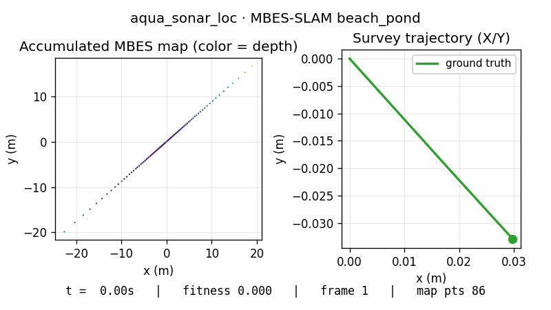
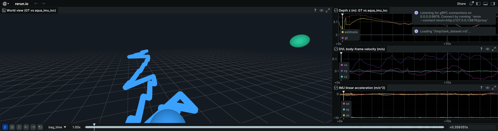
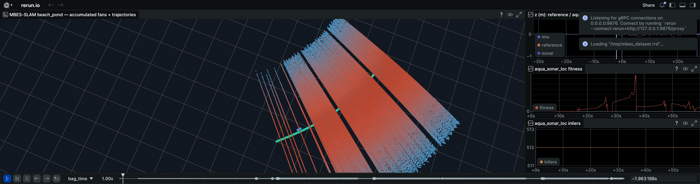
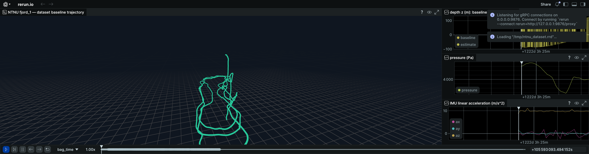
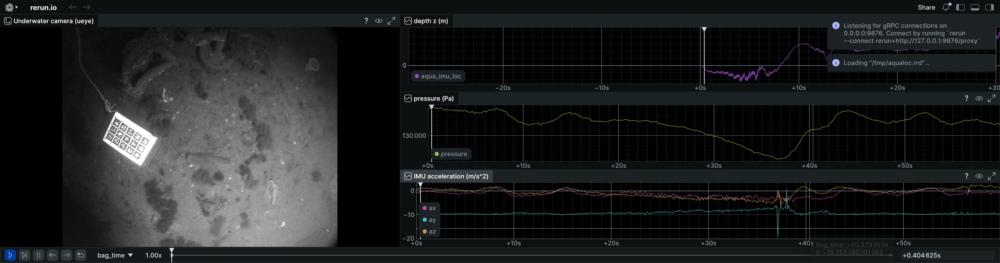
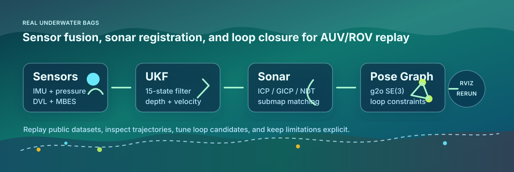

<h1 align="center">aqua_localization</h1>

<p align="center">
  <b>ROS 2 underwater localization for real AUV/ROV data.</b><br>
  Fuse IMU, pressure, DVL, sonar registration, and pose-graph loop closure
  into a stack built around public ocean datasets.
</p>

<p align="center">
  <a href="https://docs.ros.org/en/humble/"></a>
  <a href="https://docs.ros.org/en/jazzy/"></a>
  <a href="LICENSE"></a>
  <a href="https://github.com/rsasaki0109/aqua_localization/releases"></a>
  <a href="https://github.com/rsasaki0109/aqua_localization/stargazers"></a>
</p>

<p align="center">
  
</p>

Ocean localization is hard in specific ways: GNSS disappears at the surface,
pressure becomes the primary depth measurement, DVL arrives in the vehicle
frame, and sonar returns are sparse or geometrically ambiguous. This stack
keeps those underwater-specific paths explicit and testable — a 15-state
additive UKF, pressure-depth and DVL-velocity updates, PCL-based sonar
registration, a g2o SE(3) pose-graph backend, and an experimental MBES
submap loop-closure front end. The headline results are **public-data first**:
four real underwater datasets, four [rerun.io](https://rerun.io) renderings,
no synthetic-bag or simulator-only demo. Targets BlueROV2-class ROVs, custom
AUVs, and `uuv_simulator`, on ROS 2 Humble and Jazzy.

Latest release: **[v0.5](https://github.com/rsasaki0109/aqua_localization/releases/tag/v0.5)**.
If this saves bring-up time or gives your AUV/ROV project a useful baseline,
a ⭐ helps other underwater-robotics users find it — the public goal is
**10 GitHub stars** through reproducible demos and honest limitations.

## Public-Data Results

Each row has a one-shot recorder and rerun export script, so the images below
are generated from recorded demo bags rather than hand-captured screenshots.

| Dataset | What it shows | rerun view |
|---------|---------------|------------|
| **Tank Dataset `short_test`** | DVL fusion **0.43 m APE RMSE**; experimental visual-aided fusion **0.37 m** with same-sequence scale fit | [`tank_dataset_rerun.png`](docs/media/tank_dataset_rerun.png) |
| **MBES-SLAM `beach_pond`** | Multibeam fans accumulated into a depth-coloured bathymetric scan | [`mbes_slam_rerun.png`](docs/media/mbes_slam_rerun.png) |
| **NTNU `subset-fjord/fjord_1`** | Dataset SLAM baseline through a 7 m fjord dive | [`ntnu_fjord_1_rerun.png`](docs/media/ntnu_fjord_1_rerun.png) |
| **AQUALOC `harbor_07`** | LIRMM "Dumbo" ROV underwater camera + pressure depth track | [`aqualoc_harbor_07_rerun.png`](docs/media/aqualoc_harbor_07_rerun.png) |

<p>
  
  
  
  
</p>

<p align="center">
  
</p>

## Start Here

| Goal | Go to |
|------|-------|
| **30-second visual overview** | [GitHub Pages](https://rsasaki0109.github.io/aqua_localization/) |
| **Run the smallest real-bag demo** | [Tank Dataset demo](datasets/tank_dataset_demo.md) — DVL + pressure + AprilTag GT |
| **Loop-closure demo** | [No-bag smoke test](#loop-closure-smoke-test) or [real-bag MBES tuning](#experimental-mbes-loop-closure) |
| **Underwater 3DGS track** | [Play the sample viewer](https://rsasaki0109.github.io/aqua_localization/experiments/underwater_3dgs_pack_viewer.html) or [download the v0.3 pack](https://github.com/rsasaki0109/aqua_localization/releases/download/v0.3/tank_short_test_3dgs_pack_20frames.zip) |
| **Contribute** | [Issue templates](.github/ISSUE_TEMPLATE) and [CONTRIBUTING.md](CONTRIBUTING.md) |

## What It Does

| Signal | Why it matters underwater |
|--------|---------------------------|
| **Pressure depth** | Keeps the vertical axis observable below the surface. |
| **DVL velocity** | Provides vehicle-frame motion constraints for AUV/ROV dead reckoning. |
| **Stereo camera** | Experimental ORB + PnP visual odometry for Tank-style underwater stereo bags. |
| **Multibeam sonar** | Turns acoustic fans into bathymetric structure for registration. |
| **Pose graph edges** | Keeps long seafloor replays inspectable through keyframes and loop constraints. |
| **rerun / RViz views** | Shows trajectories, sonar clouds, loop candidates, and tuning diagnostics. |

## Underwater 3DGS Sample Pack

The first public 3DGS input artifact is a small Tank Dataset `short_test` pack
for quick inspection and external reconstruction experiments: 20 PNG frames, 20
matched `/apriltag_slam/GT` poses, manual Tank stereo intrinsics, and a
nerfstudio-style `transforms.json`. The readiness gate passes with
`check_3dgs_training_ready.py`. This is an input-pack artifact, not a trained
Gaussian Splatting result.

| Item | Link |
|------|------|
| Release / download | [`v0.3`](https://github.com/rsasaki0109/aqua_localization/releases/tag/v0.3) · [`tank_short_test_3dgs_pack_20frames.zip`](https://github.com/rsasaki0109/aqua_localization/releases/download/v0.3/tank_short_test_3dgs_pack_20frames.zip) |
| Play before downloading | [Interactive frame + 3D camera-path viewer](https://rsasaki0109.github.io/aqua_localization/experiments/underwater_3dgs_pack_viewer.html) |
| Rebuild the artifact | [3DGS sample pack workflow](docs/experiments/underwater_3dgs_sample_pack.md) |

## Run It

### Build

```bash
# Clone into a colcon workspace, install dependencies, build, and source.
git clone https://github.com/rsasaki0109/aqua_localization.git
cd aqua_localization && rosdep install --from-paths . --ignore-src -r -y
cd ..
colcon build --symlink-install
source install/setup.bash

# Launch the full stack with default parameters.
ros2 launch aqua_localization aqua_localization.launch.py
```

### Public Demo

The smallest validated path is the Tank Dataset `short_test` sequence: about
15 seconds of real underwater motion with IMU, pressure-derived depth, DVL,
and AprilTag ground truth.

```bash
# After following datasets/tank_dataset_demo.md to download and convert
# short_test.bag, record the estimator outputs into a self-contained demo bag.
ros2 run aqua_localization record_tank_demo.sh

# Export to rerun.io for a browser-friendly 3D + plots replay.
ros2 run aqua_localization rerun_export.py \
  --bag aqua_localization/datasets/public/tank_dataset/demo_with_estimate \
  --out /tmp/tank.rrd
rerun /tmp/tank.rrd
```

Per-dataset bring-up notes (download size, conversion, calibration, replay):
[`tank`](datasets/tank_dataset_demo.md) ·
[`mbes_slam`](datasets/mbes_slam_demo.md) ·
[`beach_pond acquisition`](datasets/mbes_slam_beach_pond_acquisition.md) ·
[`ntnu`](datasets/ntnu_demo.md) ·
[`aqualoc`](datasets/aqualoc_demo.md).

### Loop-Closure Smoke Test

No bag is needed for the pose-graph loop-closure smoke path. This starts the
g2o backend, publishes a tiny odometry chain plus one loop constraint, and
checks that the graph accepted both the keyframes and the loop edge:

```bash
ros2 run aqua_localization pose_graph_loop_smoke.sh
```

The same lower-level publisher is available as
`ros2 run aqua_localization pose_graph_loop_demo.py` when you want to launch
`aqua_pose_graph` yourself and inspect `/aqua_pose_graph/path`.

## Stack Map

| Package | Role |
|---------|------|
| [`aqua_imu_loc`](aqua_imu_loc) | 15-state additive UKF for IMU, pressure, DVL, and sonar position updates |
| [`aqua_sonar_loc`](aqua_sonar_loc) | PointCloud2 preprocessing and PCL ICP/GICP/NDT registration with a submap front end |
| [`aqua_fusion`](aqua_fusion) | Loose-coupling fusion of IMU/depth and sonar odometry |
| [`aqua_pose_graph`](aqua_pose_graph) | g2o SE(3) keyframe graph with external loop-constraint input |
| [`aqua_msgs`](aqua_msgs) | Diagnostic and fusion-input message types |
| [`aqua_localization`](aqua_localization) | Metapackage, top-level launches, dataset scripts, and replay exports |

Detailed architecture per package: [`docs/architecture.md`](docs/architecture.md).

## Experimental MBES Loop Closure

The MBES path includes an experimental submap-vs-submap loop-closure front end.
It accumulates bathymetric submaps between pose-graph keyframes, tests
odometry-near historical candidates with ICP/GICP/NDT, publishes accepted
constraints to `/aqua_pose_graph/loop_constraint`, and exposes tuning
diagnostics on `/mbes_loop_closure/status` plus RViz markers on
`/mbes_loop_closure/markers`.

Use the dedicated RViz view while tuning real bags:

```bash
ros2 launch aqua_localization replay.launch.py \
  start_bag:=true \
  bag_path:=aqua_localization/datasets/public/mbes_slam/beach_pond_ros2 \
  bag_sonar_points_topic:=/norbit/detections \
  use_sim_time:=true \
  enable_pose_graph:=true \
  enable_mbes_loop_closure:=true \
  enable_rviz:=true \
  rviz_config_file:=$(ros2 pkg prefix aqua_localization)/share/aqua_localization/rviz/mbes_loop_closure.rviz
```

This front end is not yet production-tuned; the next reliability step is
real-bag status export, threshold sweeps, and false-positive analysis.

## Visualization Exports

Two browser-friendly paths run on the same self-contained demo bag:

- **rerun.io** — the recommended default. Use
  [`rerun_export*.py`](aqua_localization/scripts) to write a `.rrd` with a
  curated 3D + plots blueprint, then open it locally with `rerun some.rrd`.
  Headless `--screenshot-to` produces the README thumbnails.
- **Lichtblick** (Apache-2.0 fork of Foxglove Studio) — drag the `.mcap` onto
  <https://lichtblick-suite.github.io/lichtblick/> and import
  [`docs/foxglove/aqua_tank_demo.json`](docs/foxglove/aqua_tank_demo.json).
  [`lichtblick_screenshot.py`](aqua_localization/scripts/lichtblick_screenshot.py)
  drives the same flow headlessly via Playwright.

Bag-recording recipe: [`docs/foxglove/README.md`](docs/foxglove/README.md).

## Project Status

The headline next milestone is **reliable real-data loop closure**. The
pose-graph backend and an experimental MBES front end are in place; the
remaining work is threshold tuning, candidate reliability, information-matrix
calibration, and eventually visual loop closure for AQUALOC. An ESKF backend,
magnetometer fusion, and acoustic positioning are also on the list. The nearest
concrete steps are a **3DGS training smoke test** on the published Tank pack, an
**MBES threshold sweep** turning loop-closure tuning into accepted/rejected
summaries, and a reproducible **AQUA-SLAM comparison run**.

Planning and validation references: [`PLAN.md`](PLAN.md) ·
[`mvp_checklist`](docs/mvp_checklist.md) ·
[`benchmarks/`](docs/benchmarks) ·
[`real_bag_evaluation`](docs/benchmarks/real_bag_evaluation.md) ·
[`sota_gap_analysis`](docs/benchmarks/sota_gap_analysis.md) ·
[`oss_comparison`](docs/benchmarks/oss_comparison.md) ·
[`aqua_slam_comparison`](docs/benchmarks/aqua_slam_comparison.md) ·
[`mbes_loop_closure`](docs/mbes_loop_closure.md) ·
[`public_launch_checklist`](docs/public_launch_checklist.md).

### Honest Limitations

- IMU-only dead reckoning drifts roughly an order of magnitude on bags without
  DVL/visual aiding (NTNU `fjord_1`, AQUALOC `harbor_07` show hundreds of meters
  of XY drift; depth `z(t)` tracks well via the pressure update).
- Single-fan multibeam registration is geometrically degenerate.
  Tightly-coupled sonar feedback narrows MBES-SLAM `beach_pond` fusion drift
  from ±40 m to ~17 m, but per-fan residuals are still ~10 m magnitude. The
  loop-closure thresholds and information matrix are not yet calibrated on a
  full real-bag tuning run.
- `aqua_fusion` has unit + runtime tests but no per-platform benchmark history
  yet.

## Testing

```bash
colcon test --packages-select \
  aqua_imu_loc aqua_sonar_loc aqua_fusion aqua_pose_graph aqua_localization \
  --event-handlers console_direct+
```

Run `colcon test-result --verbose` after testing for the current count; the
latest local validation before this README refresh reported 92 tests with zero
failures.

## Contributing

Bug reports, dataset bring-up notes, benchmark results, and focused pull
requests are welcome. Start with [`CONTRIBUTING.md`](CONTRIBUTING.md) for the
expected build/test commands and issue templates.

## License

Apache-2.0. See [`LICENSE`](LICENSE) and individual `package.xml` files for
per-package maintainer info.
