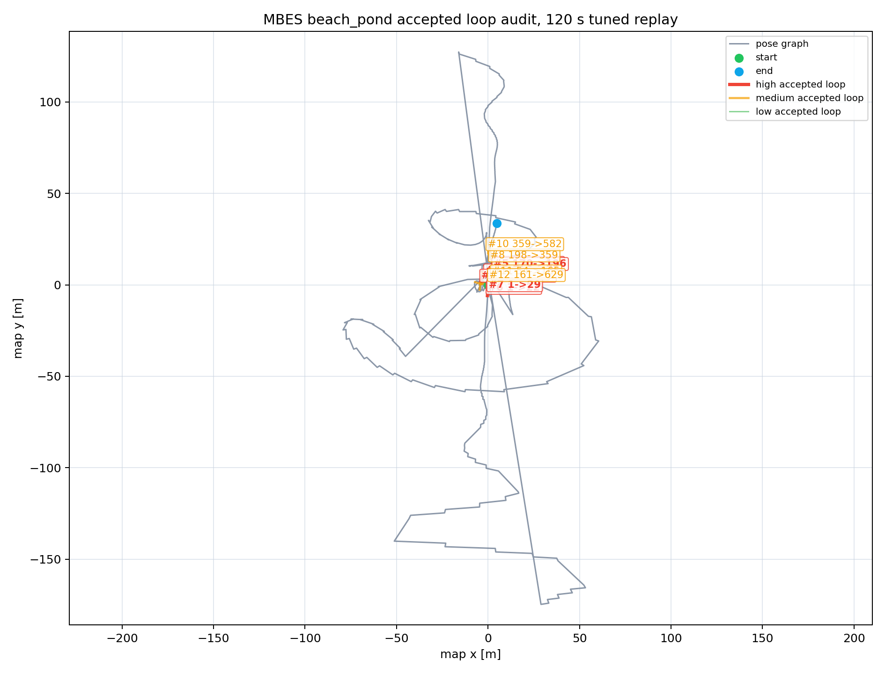

# MBES Loop Candidate Visual Audit

- Source CSV: `/tmp/aqua_mbes_loop_benchmark_tuned_120/mbes_beach_pond_loop_status.csv`
- Gate assumptions: fitness <= 2, translation <= 5 m, rotation <= 0.5 rad
- Keyframe gap warning: <= 40

## Summary

- Samples: 277
- Accepted loops: 35
- Rejected candidates: 178
- No-candidate statuses: 64
- Converged registrations: 163

## Accepted Loop Audit Priority

| Rank | Priority | Candidate -> Current | Gap | Fitness | Correction m | Rotation rad | Descriptor c/e/r | Flags | Audit note |
|-----:|----------|----------------------|----:|--------:|-------------:|-------------:|------------------|-------|------------|
| 1 | high | 70 -> 179 | 109 | 0.5456 | 1.8169 | 0.4309 | 0.6567/1.0641/0.9862 | rotation near gate | TODO: inspect accepted marker geometry |
| 2 | high | 113 -> 346 | 233 | 0.6302 | 1.6602 | 0.4054 | 0.1805/1.1563/0.9596 | rotation near gate | TODO: inspect accepted marker geometry |
| 3 | high | 54 -> 174 | 120 | 0.7311 | 3.0349 | 0.2425 | 0.0975/1.062/0.8841 | none | TODO: inspect accepted marker geometry |
| 4 | high | 124 -> 342 | 218 | 1.1949 | 1.867 | 0.2401 | 1.7165/1.1256/0.6062 | none | TODO: inspect accepted marker geometry |
| 5 | high | 170 -> 196 | 26 | 0.0377 | 1.206 | 0.3994 | 0.469/1.0107/0.967 | rotation near gate, short keyframe gap | TODO: inspect accepted marker geometry |
| 6 | high | 1 -> 22 | 21 | 0.3 | 0.4372 | 0.1751 | 0.6702/1.1039/0.4434 | short keyframe gap, low point-count ratio | TODO: inspect accepted marker geometry |
| 7 | high | 1 -> 29 | 28 | 0.0277 | 0.6754 | 0.0792 | 0.9469/1.2413/0.4283 | short keyframe gap, low point-count ratio | TODO: inspect accepted marker geometry |
| 8 | medium | 198 -> 359 | 161 | 1.0249 | 2.5017 | 0.1568 | 0.5698/1.1841/0.9813 | none | TODO: inspect accepted marker geometry |
| 9 | medium | 38 -> 70 | 32 | 0.8337 | 2.3592 | 0.1583 | 0.0283/1.0941/0.9776 | short keyframe gap | TODO: inspect accepted marker geometry |
| 10 | medium | 359 -> 582 | 223 | 0.5338 | 1.6907 | 0.2956 | 0.5528/1.0833/0.9589 | none | TODO: inspect accepted marker geometry |
| 11 | medium | 54 -> 165 | 111 | 0.0861 | 2.5142 | 0.3107 | 0.7012/1.0806/0.9227 | none | TODO: inspect accepted marker geometry |
| 12 | medium | 161 -> 629 | 468 | 0.0543 | 2.9038 | 0.2763 | 0.8955/1.1923/0.9906 | none | TODO: inspect accepted marker geometry |
| 13 | medium | 198 -> 585 | 387 | 0.6787 | 2.089 | 0.1805 | 0.3067/1.0879/0.9579 | none | TODO: inspect accepted marker geometry |
| 14 | medium | 89 -> 345 | 256 | 0.1929 | 1.1507 | 0.387 | 0.2442/1.0757/0.9673 | rotation near gate | TODO: inspect accepted marker geometry |
| 15 | medium | 53 -> 81 | 28 | 0.0347 | 2.8955 | 0.2243 | 0.2206/1.0625/0.9437 | short keyframe gap | TODO: inspect accepted marker geometry |
| 16 | medium | 4 -> 124 | 120 | 0.0205 | 3.5234 | 0.1262 | 0.268/1.0281/0.9727 | none | TODO: inspect accepted marker geometry |
| 17 | medium | 81 -> 344 | 263 | 0.1284 | 3.0135 | 0.1474 | 0.1855/1.3244/0.9541 | none | TODO: inspect accepted marker geometry |
| 18 | medium | 143 -> 235 | 92 | 0.053 | 3.4787 | 0.1107 | 0.7683/1.1378/0.9765 | none | TODO: inspect accepted marker geometry |
| 19 | medium | 70 -> 92 | 22 | 0.0324 | 1.4343 | 0.2988 | 0.1751/1.0405/0.9495 | short keyframe gap | TODO: inspect accepted marker geometry |
| 20 | medium | 195 -> 508 | 313 | 0.1232 | 1.9112 | 0.2266 | 0.6755/1.0947/0.95 | none | TODO: inspect accepted marker geometry |
| 21 | medium | 70 -> 170 | 100 | 0.0256 | 1.5803 | 0.2729 | 0.1175/1.0574/0.9725 | none | TODO: inspect accepted marker geometry |
| 22 | medium | 4 -> 143 | 139 | 0.0156 | 3.3368 | 0.0981 | 0.1628/1.0551/0.9682 | none | TODO: inspect accepted marker geometry |
| 23 | medium | 4 -> 53 | 49 | 0.1107 | 3.1436 | 0.0915 | 0.081/1.0933/0.9524 | none | TODO: inspect accepted marker geometry |
| 24 | medium | 125 -> 148 | 23 | 0.1237 | 1.6545 | 0.2294 | 0.193/1.0314/0.9541 | short keyframe gap | TODO: inspect accepted marker geometry |
| 25 | medium | 53 -> 89 | 36 | 0.0226 | 2.3089 | 0.1775 | 0.1066/1.0428/0.8961 | short keyframe gap | TODO: inspect accepted marker geometry |
| 26 | medium | 38 -> 83 | 45 | 0.727 | 1.1176 | 0.1138 | 0.1986/1.0822/0.9641 | none | TODO: inspect accepted marker geometry |
| 27 | medium | 38 -> 93 | 55 | 0.7872 | 0.7656 | 0.1295 | 0.1799/1.0841/0.9731 | none | TODO: inspect accepted marker geometry |
| 28 | medium | 81 -> 113 | 32 | 0.0158 | 1.685 | 0.2245 | 0.0466/1.0552/0.9776 | short keyframe gap | TODO: inspect accepted marker geometry |
| 29 | medium | 89 -> 161 | 72 | 0.0072 | 1.0915 | 0.2823 | 0.17/1.0072/0.9857 | none | TODO: inspect accepted marker geometry |
| 30 | medium | 54 -> 97 | 43 | 0.2275 | 1.4685 | 0.1713 | 0.7748/1.0471/0.9442 | none | TODO: inspect accepted marker geometry |
| 31 | medium | 81 -> 162 | 81 | 0.008 | 0.9598 | 0.2506 | 0.1421/1.0898/0.9725 | none | TODO: inspect accepted marker geometry |
| 32 | medium | 97 -> 195 | 98 | 0.0272 | 1.0536 | 0.2163 | 0.9226/1.0624/0.95 | none | TODO: inspect accepted marker geometry |
| 33 | medium | 4 -> 38 | 34 | 0.0072 | 2.2737 | 0.0826 | 0.2024/1.1206/0.9865 | short keyframe gap | TODO: inspect accepted marker geometry |
| 34 | medium | 7 -> 28 | 21 | 0.0121 | 0.5712 | 0.1191 | 0.6496/1.027/0.8872 | short keyframe gap | TODO: inspect accepted marker geometry |
| 35 | low | 70 -> 197 | 127 | 0.2301 | 1.3262 | 0.1067 | 0.0864/1.0345/0.9541 | none | TODO: inspect accepted marker geometry |

## Status Counts

| Status | Count |
|--------|------:|
| duplicate loop suppressed | 103 |
| no candidate submaps | 64 |
| registration did not converge | 50 |
| accepted | 35 |
| fitness score exceeds gate | 21 |
| rotation correction exceeds gate | 2 |
| translation correction exceeds gate | 2 |

## Audit Rule

Mark an accepted loop as usable evidence only after its accepted RViz/rerun edge connects a plausible revisit, not an adjacent duplicate or an obvious registration jump. Keep the benchmark row labelled unaudited until every accepted loop above has a note.
