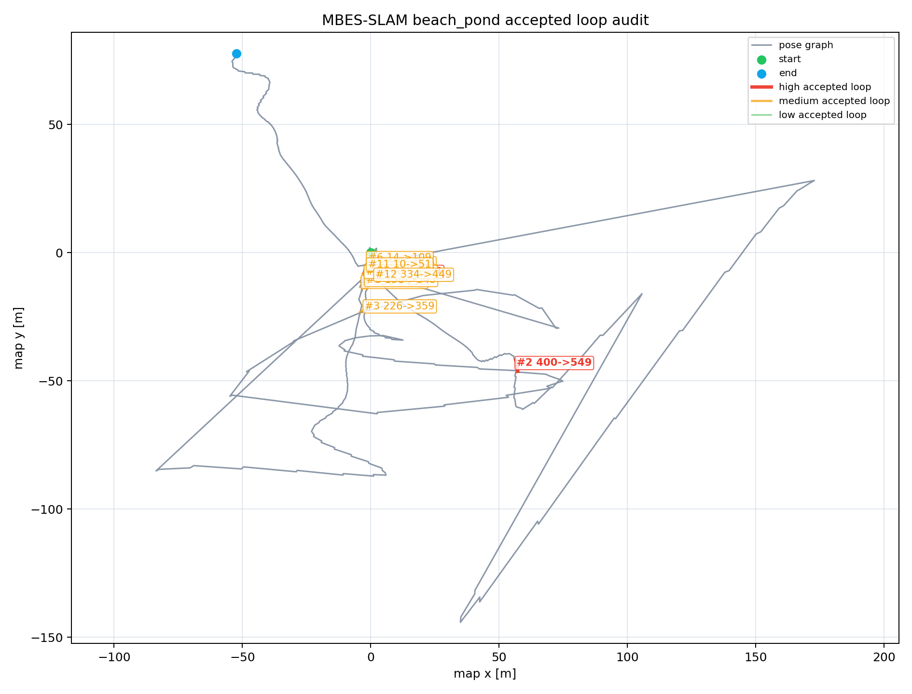

# MBES Loop Candidate Visual Audit

- Source CSV: `/tmp/aqua_mbes_loop_benchmark_gap40_120/mbes_beach_pond_loop_status.csv`
- Gate assumptions: fitness <= 2, translation <= 5 m, rotation <= 0.5 rad
- Keyframe gap warning: <= 40

## Summary

- Samples: 338
- Accepted loops: 35
- Rejected candidates: 194
- No-candidate statuses: 109
- Converged registrations: 133

## Accepted Loop Audit Priority

| Rank | Priority | Candidate -> Current | Gap | Fitness | Correction m | Rotation rad | Descriptor c/e/r | Flags | Audit note |
|-----:|----------|----------------------|----:|--------:|-------------:|-------------:|------------------|-------|------------|
| 1 | high | 40 -> 334 | 294 | 0.0918 | 2.2854 | 0.4673 | 0.2395/1.1043/0.927 | rotation near gate | TODO: inspect accepted marker geometry |
| 2 | high | 400 -> 549 | 149 | 0.9819 | 1.2766 | 0.3181 | 0.9245/6.3644/0.9342 | large extent ratio | TODO: inspect accepted marker geometry |
| 3 | medium | 226 -> 359 | 133 | 0.134 | 3.7615 | 0.2396 | 1.2166/1.0488/0.9628 | translation near gate | TODO: inspect accepted marker geometry |
| 4 | medium | 56 -> 212 | 156 | 0.422 | 2.2997 | 0.2726 | 0.1297/1.3072/0.9954 | none | TODO: inspect accepted marker geometry |
| 5 | medium | 36 -> 147 | 111 | 0.0152 | 1.7687 | 0.4015 | 0.8099/1.1303/0.95 | rotation near gate | TODO: inspect accepted marker geometry |
| 6 | medium | 14 -> 109 | 95 | 0.1069 | 2.4847 | 0.2867 | 0.2302/1.0224/0.9954 | none | TODO: inspect accepted marker geometry |
| 7 | medium | 40 -> 177 | 137 | 0.0072 | 1.2538 | 0.4242 | 0.9019/1.0552/0.7701 | rotation near gate | TODO: inspect accepted marker geometry |
| 8 | medium | 158 -> 343 | 185 | 0.2476 | 1.6112 | 0.3204 | 0.5193/1.2999/1 | none | TODO: inspect accepted marker geometry |
| 9 | medium | 153 -> 202 | 49 | 0.2319 | 1.925 | 0.2923 | 0.2842/1.1/1 | none | TODO: inspect accepted marker geometry |
| 10 | medium | 40 -> 135 | 95 | 0.0506 | 0.8419 | 0.4298 | 0.9841/1.0154/0.7664 | rotation near gate | TODO: inspect accepted marker geometry |
| 11 | medium | 10 -> 51 | 41 | 0.5221 | 2.4114 | 0.148 | 0.1366/1.166/0.9442 | none | TODO: inspect accepted marker geometry |
| 12 | medium | 334 -> 449 | 115 | 0.0137 | 2.0266 | 0.2686 | 0.2884/1.0275/0.874 | none | TODO: inspect accepted marker geometry |
| 13 | medium | 51 -> 201 | 150 | 0.0731 | 2.0605 | 0.2486 | 0.6182/1.0276/0.8927 | none | TODO: inspect accepted marker geometry |
| 14 | medium | 212 -> 342 | 130 | 0.0614 | 1.5705 | 0.2758 | 0.2066/1.15/0.9721 | none | TODO: inspect accepted marker geometry |
| 15 | medium | 51 -> 119 | 68 | 0.0235 | 1.6517 | 0.2628 | 0.0614/1.0683/0.9142 | none | TODO: inspect accepted marker geometry |
| 16 | medium | 174 -> 344 | 170 | 0.2948 | 1.0876 | 0.2479 | 0.1897/1.1589/0.9906 | none | TODO: inspect accepted marker geometry |
| 17 | medium | 10 -> 193 | 183 | 0.0655 | 0.8721 | 0.3023 | 0.2667/1.1244/0.9818 | none | TODO: inspect accepted marker geometry |
| 18 | medium | 36 -> 114 | 78 | 0.021 | 2.0904 | 0.1895 | 0.7962/1.1226/0.9727 | none | TODO: inspect accepted marker geometry |
| 19 | medium | 42 -> 149 | 107 | 0.0423 | 0.3133 | 0.3605 | 0.3351/1.0335/0.9554 | none | TODO: inspect accepted marker geometry |
| 20 | medium | 119 -> 175 | 56 | 0.0111 | 0.975 | 0.2994 | 0.207/1.1002/0.9906 | none | TODO: inspect accepted marker geometry |
| 21 | medium | 132 -> 173 | 41 | 0.0163 | 0.9581 | 0.2967 | 0.0332/1.14/0.986 | none | TODO: inspect accepted marker geometry |
| 22 | medium | 56 -> 341 | 285 | 0.0888 | 2.0259 | 0.163 | 0.4444/1.0311/0.9676 | none | TODO: inspect accepted marker geometry |
| 23 | medium | 175 -> 446 | 271 | 0.0675 | 1.0296 | 0.2667 | 1.4439/1.179/0.7456 | none | TODO: inspect accepted marker geometry |
| 24 | medium | 0 -> 41 | 41 | 0.0744 | 0.3664 | 0.317 | 1.002/1.2422/0.9724 | none | TODO: inspect accepted marker geometry |
| 25 | medium | 51 -> 150 | 99 | 0.0798 | 1.9087 | 0.1579 | 0.3348/1.0209/0.9227 | none | TODO: inspect accepted marker geometry |
| 26 | medium | 42 -> 125 | 83 | 0.0087 | 1.5949 | 0.1894 | 0.1392/1.0976/0.9598 | none | TODO: inspect accepted marker geometry |
| 27 | medium | 340 -> 453 | 113 | 0.0234 | 1.6409 | 0.1679 | 0.5066/1.0846/0.9591 | none | TODO: inspect accepted marker geometry |
| 28 | medium | 51 -> 172 | 121 | 0.0114 | 1.4088 | 0.1846 | 0.1522/1.2388/0.8884 | none | TODO: inspect accepted marker geometry |
| 29 | low | 51 -> 131 | 80 | 0.0109 | 1.1175 | 0.2071 | 0.1987/1.1252/0.9013 | none | TODO: inspect accepted marker geometry |
| 30 | low | 6 -> 69 | 63 | 0.0051 | 1.7572 | 0.1192 | 0.4489/1.0728/0.6625 | none | TODO: inspect accepted marker geometry |
| 31 | low | 3 -> 95 | 92 | 0.0152 | 2.4175 | 0.0479 | 0.2557/1.0271/0.5847 | none | TODO: inspect accepted marker geometry |
| 32 | low | 36 -> 127 | 91 | 0.0213 | 0.7547 | 0.205 | 0.5425/1.027/0.9591 | none | TODO: inspect accepted marker geometry |
| 33 | low | 4 -> 84 | 80 | 0.0109 | 2.008 | 0.065 | 1.0317/1.1667/0.6577 | none | TODO: inspect accepted marker geometry |
| 34 | low | 40 -> 448 | 408 | 0.201 | 0.0037 | 0.1915 | 1.0326/1.0451/0.7737 | none | TODO: inspect accepted marker geometry |
| 35 | low | 53 -> 158 | 105 | 0.0231 | 0.4442 | 0.1609 | 0.7769/1.2638/0.9953 | none | TODO: inspect accepted marker geometry |

## Status Counts

| Status | Count |
|--------|------:|
| no candidate submaps | 109 |
| registration did not converge | 96 |
| duplicate loop suppressed | 87 |
| accepted | 35 |
| fitness score exceeds gate | 11 |

## Audit Rule

Mark an accepted loop as usable evidence only after its accepted RViz/rerun edge connects a plausible revisit, not an adjacent duplicate or an obvious registration jump. Keep the benchmark row labelled unaudited until every accepted loop above has a note.
