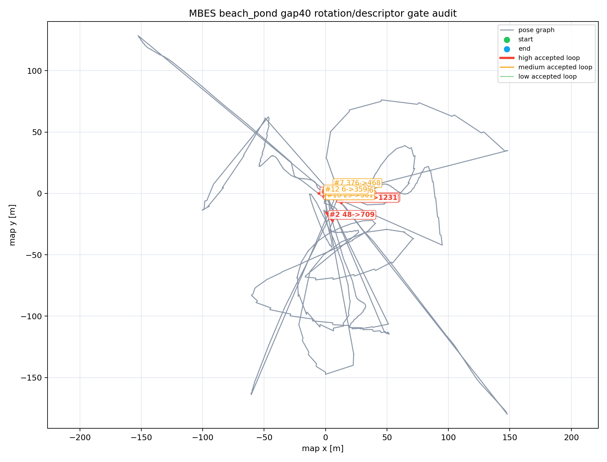

# MBES Loop Candidate Visual Audit

- Source CSV: `/tmp/aqua_mbes_loop_benchmark_gap40_gate_120/mbes_beach_pond_loop_status.csv`
- Gate assumptions: fitness <= 2, translation <= 5 m, rotation <= 0.4 rad
- Keyframe gap warning: <= 80

## Summary

- Samples: 462
- Accepted loops: 17
- Rejected candidates: 261
- No-candidate statuses: 184
- Converged registrations: 110

## Accepted Loop Audit Priority

| Rank | Priority | Candidate -> Current | Gap | Fitness | Correction m | Rotation rad | Descriptor c/e/r | Flags | Audit note |
|-----:|----------|----------------------|----:|--------:|-------------:|-------------:|------------------|-------|------------|
| 1 | high | 396 -> 1108 | 712 | 0.756 | 4.866 | 0.1781 | 0.2253/1.1167/0.9602 | translation near gate | TODO: inspect accepted marker geometry |
| 2 | high | 48 -> 709 | 661 | 0.9823 | 3.9383 | 0.1095 | 0.2458/1.1602/0.9452 | translation near gate | TODO: inspect accepted marker geometry |
| 3 | high | 669 -> 985 | 316 | 0.0755 | 2.5554 | 0.3799 | 0.0236/1.156/0.8 | rotation near gate | TODO: inspect accepted marker geometry |
| 4 | high | 1105 -> 1231 | 126 | 0.1427 | 1.9751 | 0.3791 | 0.6588/1.1929/0.92 | rotation near gate | TODO: inspect accepted marker geometry |
| 5 | high | 357 -> 799 | 442 | 0.0356 | 3.8632 | 0.2306 | 0.1072/1.1522/0.9507 | translation near gate | TODO: inspect accepted marker geometry |
| 6 | high | 0 -> 357 | 357 | 0.0113 | 1.5548 | 0.351 | 1.201/1.3085/0.3369 | rotation near gate, low point-count ratio | TODO: inspect accepted marker geometry |
| 7 | medium | 376 -> 468 | 92 | 0.0562 | 3.0711 | 0.2507 | 0.3005/1.139/0.9767 | none | TODO: inspect accepted marker geometry |
| 8 | medium | 2 -> 219 | 217 | 0.0198 | 1.5337 | 0.2811 | 0.0938/1.1943/0.8145 | none | TODO: inspect accepted marker geometry |
| 9 | medium | 499 -> 669 | 170 | 0.0045 | 1.6322 | 0.2233 | 0.1486/1.0055/0.8093 | none | TODO: inspect accepted marker geometry |
| 10 | medium | 29 -> 501 | 472 | 0.0186 | 1.6216 | 0.1901 | 0.1124/1.0269/0.9185 | none | TODO: inspect accepted marker geometry |
| 11 | medium | 14 -> 216 | 202 | 0.0154 | 1.4237 | 0.1898 | 0.1467/1.0942/0.9865 | none | TODO: inspect accepted marker geometry |
| 12 | medium | 6 -> 359 | 353 | 0.007 | 1.0195 | 0.1833 | 1.1599/1.0915/0.6699 | none | TODO: inspect accepted marker geometry |
| 13 | low | 26 -> 667 | 641 | 0.0196 | 0.6779 | 0.1994 | 0.9901/1.0794/0.6581 | none | TODO: inspect accepted marker geometry |
| 14 | low | 669 -> 788 | 119 | 0.0381 | 1.4334 | 0.1331 | 0.2616/1.0378/0.963 | none | TODO: inspect accepted marker geometry |
| 15 | low | 21 -> 499 | 478 | 0.009 | 1.0358 | 0.1605 | 0.4365/1.0104/0.8677 | none | TODO: inspect accepted marker geometry |
| 16 | low | 23 -> 218 | 195 | 0.0069 | 1.0827 | 0.1499 | 0.1763/1.0089/0.7035 | none | TODO: inspect accepted marker geometry |
| 17 | low | 34 -> 671 | 637 | 0.0746 | 0.4599 | 0.1101 | 0.1609/1.0981/0.9289 | none | TODO: inspect accepted marker geometry |

## Status Counts

| Status | Count |
|--------|------:|
| no candidate submaps | 184 |
| registration did not converge | 162 |
| duplicate loop suppressed | 42 |
| fitness score exceeds gate | 23 |
| rotation correction exceeds gate | 23 |
| accepted | 17 |
| descriptor gate rejected | 6 |
| translation correction exceeds gate | 5 |

## Audit Rule

Mark an accepted loop as usable evidence only after its accepted RViz/rerun edge connects a plausible revisit, not an adjacent duplicate or an obvious registration jump. Keep the benchmark row labelled unaudited until every accepted loop above has a note.
